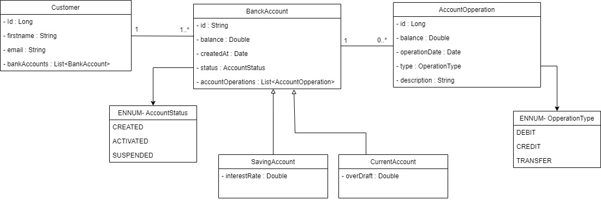
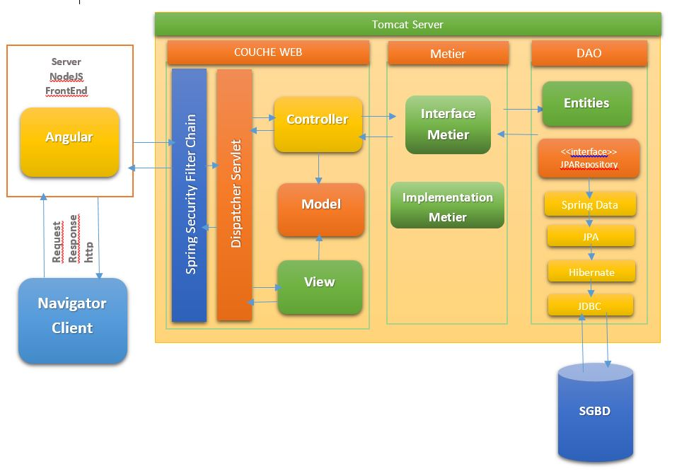

# Online-banking-BackEnd

Online-Bank

Spring Boot/Spring Data/Spring Security/Hibernate/MySQL/REST


The project is a simulation of an online banking system that allows the management of bank accounts. Each account is associated with a client and can be categorized as either Current or Savings. Various operations such as debit and credit can be performed on each account. The application follows a layered architecture consisting of the following components:

  - DAO layer: This layer includes JPA entities and repositories, which handle the persistence of data in the database.
  - Service layer: The service layer defines the core operations of the application. These operations include adding accounts and clients, performing debit and credit transactions, executing transfers between accounts, and       providing the ability to consult account information.
  - DTO layer: The DTO (Data Transfer Object) layer is responsible for defining data transfer objects that facilitate the exchange of information between different layers of the application.
  - Mappers: Mappers are used to convert data between DTOs and entities, ensuring seamless communication between layers.
  - Web layer: The web layer consists of REST controllers that expose the functionality of the application through RESTful APIs, allowing clients to interact with the system.
    
In summary, this project implements an online banking system with the ability to manage bank accounts, perform transactions, and provide client services. The layered architecture and the defined components ensure a structured and efficient development and operation of the application.

## Getting Started 

__Clone the repository__
```
git clone https://github.com/chifaabelmaaza/EbankJEE-Backend 
```

__Go the folder__
```
EbankJEE-Backend
```

__Set Your MySQL username & password in application.properties__

[application.properties](src/main/resources/application.properties)

__Run the application__

Run the backend project by clicking on the "Run" button in your IDE (e.g., Eclipse or IntelliJ).

> Note:  Make sure you have properly set up your Java and Maven environment to run a Spring Boot project.

## Conception
1.	Class Diagram :
   



2.	Architecture Diagram : 
   


3.	Why spring ?

Spring is a widely-used Java framework known for its benefits in building robust and scalable applications. It offers features such as dependency injection and inversion of control, which promote modularity and maintainability. Spring MVC provides a structured framework for web application development. It integrates seamlessly with other Java technologies and supports aspect-oriented programming for cross-cutting concerns. Spring enhances testability, has a large community and ecosystem, and simplifies Java development by providing comprehensive features and promoting best practices. Overall, Spring is a versatile framework that facilitates efficient and reliable application development.

## FrontEnd : 

__Here is the link to the frontEnd part, you can clone it using the commande bellow, and make sure to follow the steps mentionned in the Readme__

[FrontEnd](https://github.com/chifaabelmaaza/Ebank-Jee-FrontEnd.git)

```
git clone https://github.com/chifaabelmaaza/Ebank-Jee-FrontEnd.git
```

> Note: Please refer to the project documentation for detailed instructions on setting up and running the backend application. Feel free to reach out to us with any questions or feedback.

Happy exploring and thank you for your interest in our backend project!
